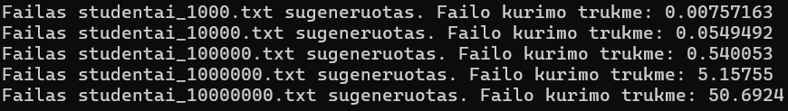

# v0.3 release

Studentų galutinio pažymio skaičiavimo programa.

## Struktūra:
- pradineVersija.cpp pagrindinis vykdomasis taškas;
- Mylib.h bibliotekų failas;
- Stud.h studentų struktūros bei funkcijų deklaracijų failas;
- Stud.cpp funkcijų failas.

## Sukurtos funkcijos:
- ivestis() - duomenims įvesti ranka arba generuoti atsitiktinai;
- isvestisIsFailo() - duomenims nuskaityti iš .txt failo;
- rusiavimas() - studentų pavardėms rūšiuoti abėcėlės tvarka;
- rezultatai() - galutiniam pažymiui skaičiuoti;
- isvestis() - studentų pavardei, vardui bei galutiniam pažymiui išvesti;
- generuotiFaila() - generuoti atsitiktinių studentų duomenų .txt failą;
- studentoKategorija() - išskiria studentus į dvi grupes pagal galutinį pažymį;
- isvestisIFaila() - į dvi grupes padalinti studentai išvedami į .txt failą.

## Funkcionalumas:
- galima studento duomenų įvestis terminale arba .txt failo nuskaitymas;
- pasirinkimas tarp keleto galimų nuskaityti failų;
- galimybė įvesti pažymius ranka arba generuoti atsitiktinai;
- neapribotas namų darbų pažymių įvedimo skaičius;
- pranešimai apie įvesties klaidas ir galimybė įvesti paskutinį vestą rodmenį naujai (exception handling);
- galimybė generuoti 5 skirtingo dydžio .txt failus su atsitiktiniais studentų duomenimis;
- studentų padalijimas į dvi grupes pagal galutinį pažymį, jų išvedimas į atskirus .txt failus;
- programos veikimo spartos analizė;
- galimybė pasirinkti konteinerį duomenims saugoti (list/vector).

## Spartos analizė:

|Parametras          |Virtual Machine (Windows 11)          |Host Machine (MacBook)           |
|--------------------|--------------------------------------|---------------------------------|
|Operacinė sistema   | Windows 11                           | macOS Sonoma 14.6.1             |
|CPU                 | 4 branduoliai (priskirti)            | 8 branduoliai                   |
|RAM                 | 8 GB                                 | 16 GB                           |
|Saugykla            | Virtualus diskas SSD                 | 512 GB SSD                      |
|VMware Version      | VMware Fusion 13                     | -                               |  
  

  

Pateiktas testavimų vidurkis:

1000 įrašų įrašymo į failą laikas: 0.00891588 s  
10000 įrašų įrašymo į failą laikas: 0.0606197 s  
100000 įrašų įrašymo į failą laikas: 0.529976 s  
1000000 įrašų įrašymo į failą laikas: 5.06744 s  
10000000 įrašų įrašymo į failą laikas: 50.9319 s  

|Failo eilučių  |Kriterijus                 |Vector laikas    |List laikas     |
|---------------|---------------------------|-----------------|----------------|
|1000           |Nuskaitymas                |0.0113095 s      |0.0138963 s     |
|               |Dalijimas į dvi grupes     |0.00056075 s     |0.000387625 s   |
|               |Įrašymas galvociai.txt     |0.00555825 s     |0.00592483 s    |
|               |Įrašymas nuskriaustukai.txt|0.00374054 s     |0.00366213 s    |
|               |Bendras veikimo laikas     |0.021169 s       |0.0238708 s     |
|10000          |Nuskaitymas                |0.10496 s        |0.125007 s      |
|               |Dalijimas į dvi grupes     |0.00449438 s     |0.00265867 s    |
|               |Įrašymas galvociai.txt     |0.0474353 s      |0.0482639 s     |
|               |Įrašymas nuskriaustukai.txt|0.0379377 s      |0.0340268 s     |
|               |Bendras veikimo laikas     |0.194827 s       |0.209956 s      |
|100000         |Nuskaitymas                |0.962287 s       |0.960303 s      |
|               |Dalijimas į dvi grupes     |0.0254281 s      |0.0367531 s     |
|               |Įrašymas galvociai.txt     |0.496531 s       |0.510438 s      |
|               |Įrašymas nuskriaustukai.txt|0.344024 s       |0.342789 s      |
|               |Bendras veikimo laikas     |1.82827 s        |1.85028 s       |
|1000000        |Nuskaitymas                |9.57618 s        |9.45731 s       |
|               |Dalijimas į dvi grupes     |0.498318 s       |0.396237 s      |
|               |Įrašymas galvociai.txt     |4.64819 s        |4.82819 s       |
|               |Įrašymas nuskriaustukai.txt|3.29679 s        |3.35625 s       |
|               |Bendras veikimo laikas     |18.0195 s        |18.038 s        |
|10000000       |Nuskaitymas                |101.191 s        |99.2413 s       |
|               |Dalijimas į dvi grupes     |4.53757 s        |5.69798 s       |
|               |Įrašymas galvociai.txt     |46.4808 s        |48.4736 s       |
|               |Įrašymas nuskriaustukai.txt|32.7055 s        |33.2447 s       |
|               |Bendras veikimo laikas     |184.915 s        |186.658 s       |  

Išvados:
- vector konteineriuose talpinami duomenys buvo apdorojami greičiau nei list;
- list konteineriai greičiau dalijami į dvi grupes kai dirbama su mažesniais failais;
- bendru atveju spartos skirtumas tarp vector ir list konteinerių nėra didelis.
